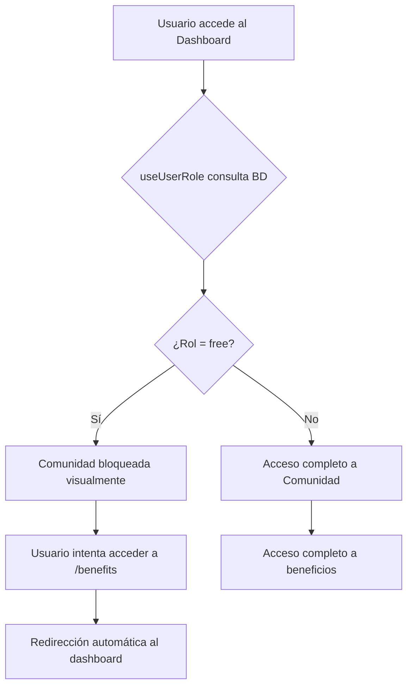

# Control de Acceso Basado en Roles (Role-Based Access Control)

## Resumen

Este documento describe la implementación del sistema de control de acceso basado en roles que restringe el acceso a contenido premium para usuarios con rol "free".

## Tabla en Supabase

El sistema utiliza la tabla `user_roles` en Supabase que debe tener la siguiente estructura:

```sql
-- Tabla user_roles
user_id (uuid, foreign key a auth.users)
role_name (text) -- Valores: "free" o "premium"
```

## Archivos Modificados

### 1. `lib/hooks/use-user-role.ts` (NUEVO)

Hook personalizado que:
- Obtiene el usuario autenticado actual
- Consulta su rol desde la tabla `user_roles`
- Retorna el rol del usuario y estados de utilidad:
  - `role`: El nombre del rol ("free" | "premium" | null)
  - `isLoading`: Estado de carga
  - `isFreeUser`: Boolean que indica si el usuario tiene rol "free"
  - `isPremiumUser`: Boolean que indica si el usuario tiene rol "premium"

**Comportamiento por defecto**: Si no se encuentra un rol en la base de datos, se asume "premium". Solo los usuarios explícitamente marcados como "free" tienen acceso restringido.

### 2. `app/dashboard/page.tsx` (MODIFICADO)

Implementa las siguientes restricciones para usuarios "free":

#### Cambios principales:
1. **Importa y usa el hook `useUserRole`** para obtener el rol del usuario
2. **Bloquea el acordeón "Comunidad"**:
   - El usuario puede VER la sección pero NO puede hacer clic en ella
   - Se muestra un ícono de candado 🔒
   - La sección aparece con opacidad reducida (60%)
   - El cursor cambia a "not-allowed"
   - La descripción cambia a "Acceso exclusivo para miembros premium"

3. **Oculta los items dentro de Comunidad**:
   - "Comunidad de WhatsApp" - NO se muestra para usuarios free
   - "Beneficios Exclusivos" - NO se muestra para usuarios free

#### Código clave:
```typescript
// Bloquea el toggle del acordeón
const toggleSection = (sectionId: string) => {
  if (sectionId === "comunidad" && isFreeUser) {
    return // No hace nada
  }
  // ... resto del código
}

// Filtra el contenido
const getComunidadContent = () => {
  if (isFreeUser) {
    return [] // Retorna array vacío para usuarios free
  }
  return [
    "Comunidad de WhatsApp",
    "Beneficios Exclusivos"
  ]
}
```

### 3. `app/dashboard/benefits/page.tsx` (MODIFICADO)

Protege completamente la página de beneficios:

#### Cambios principales:
1. **Importa y usa el hook `useUserRole`**
2. **Redirección automática**: Si el usuario tiene rol "free", se redirige automáticamente al dashboard
3. **Pantalla de acceso denegado**: Como respaldo, muestra un mensaje de acceso restringido si un usuario free intenta acceder directamente

#### Comportamiento:
- **Usuario Premium**: Accede normalmente a los códigos de descuento de v0 y 021
- **Usuario Free**: Es redirigido automáticamente al dashboard o ve mensaje de acceso denegado

## Flujo de Seguridad



## Seguridad

### Nivel Cliente (Implementado)
- ✅ Validación en componentes React
- ✅ Redirecciones automáticas
- ✅ Ocultamiento de UI

### Nivel Servidor (Recomendado para producción)
Para mayor seguridad, se recomienda implementar:

1. **Row Level Security (RLS) en Supabase**:
```sql
-- Política para proteger contenido premium
CREATE POLICY "Premium content access" ON premium_content
FOR SELECT USING (
  auth.uid() IN (
    SELECT user_id FROM user_roles 
    WHERE role_name = 'premium'
  )
);
```

2. **Middleware de Next.js** (opcional):
```typescript
// En middleware.ts
if (request.nextUrl.pathname.startsWith('/dashboard/benefits')) {
  // Verificar rol desde servidor antes de permitir acceso
}
```

## Experiencia de Usuario

### Usuario con rol "free":
- ✅ Ve todas las secciones del dashboard
- ✅ Puede acceder a: Guía Rápida, Material Complementario, Material de Clase, Clases Grabadas
- ❌ NO puede expandir la sección "Comunidad"
- ❌ NO ve los enlaces a WhatsApp ni Beneficios
- ❌ NO puede acceder a `/dashboard/benefits`
- 👁️ Ve claramente que "Comunidad" es contenido premium (ícono de candado)

### Usuario con rol "premium":
- ✅ Acceso completo a todas las secciones
- ✅ Puede expandir "Comunidad"
- ✅ Ve y accede a WhatsApp y Beneficios
- ✅ Puede acceder a `/dashboard/benefits` con códigos de descuento

## Testing

Para probar la implementación:

1. **Crear usuario de prueba "free"**:
```sql
-- En Supabase SQL Editor
INSERT INTO user_roles (user_id, role_name)
VALUES ('uuid-del-usuario', 'free');
```

2. **Verificar comportamiento**:
   - Login con usuario free
   - Intentar hacer clic en "Comunidad" → No debería expandirse
   - Intentar acceder a `/dashboard/benefits` → Debería redirigir

3. **Crear usuario de prueba "premium"**:
```sql
UPDATE user_roles 
SET role_name = 'premium' 
WHERE user_id = 'uuid-del-usuario';
```

4. **Verificar comportamiento premium**:
   - Login con usuario premium
   - Hacer clic en "Comunidad" → Debería expandirse
   - Ver enlaces a WhatsApp y Beneficios
   - Acceder a `/dashboard/benefits` → Debería mostrar códigos

## Escalabilidad

Este sistema está diseñado para escalar fácilmente:

1. **Agregar más roles**: Solo modificar el tipo `UserRole` en `use-user-role.ts`
2. **Agregar más restricciones**: Usar `isFreeUser` en cualquier componente
3. **Contenido gradual**: Fácil de agregar niveles intermedios (ej: "basic", "pro", "enterprise")

## Lenguaje No-Técnico

**¿Qué hace este sistema?**

Ahora la aplicación puede distinguir entre usuarios "gratuitos" y usuarios "premium". Los usuarios gratuitos pueden ver casi todo el contenido del programa, pero no pueden acceder a la sección de Comunidad donde están los links al grupo de WhatsApp y los beneficios exclusivos como códigos de descuento.

**¿Cómo funciona?**

Cuando un usuario inicia sesión, la aplicación consulta en la base de datos qué tipo de usuario es. Si es "free" (gratuito), automáticamente se bloquea el acceso a contenido exclusivo. El usuario puede VER que existe la sección de Comunidad, pero aparece con un candado 🔒 y no puede hacer clic en ella. Si intenta acceder directamente escribiendo la URL en el navegador, la aplicación lo redirige automáticamente.

**¿Qué ve un usuario gratuito?**

- ✅ Todo el material de clases
- ✅ Videos grabados  
- ✅ Glosarios y vocabulario
- ✅ Herramientas y recursos
- 🔒 La sección "Comunidad" bloqueada con un mensaje: "Acceso exclusivo para miembros premium"

**¿Qué necesita hacer el usuario para obtener acceso premium?**

El administrador del sistema debe actualizar manualmente el rol del usuario en la base de datos de "free" a "premium".

