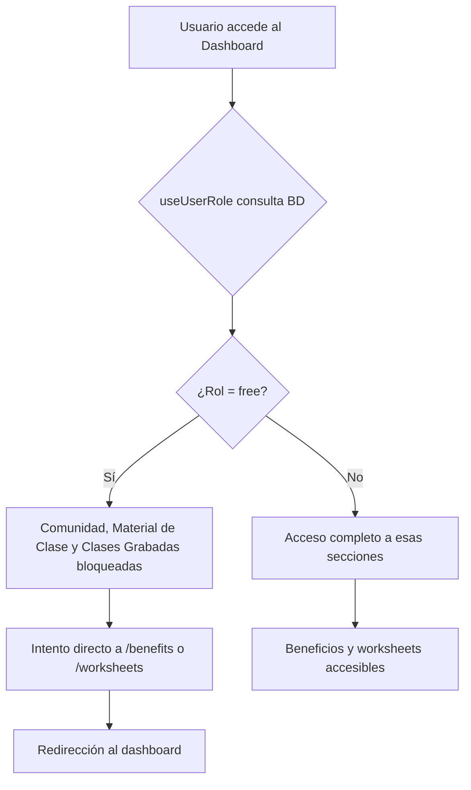

# Control de Acceso Basado en Roles (Role-Based Access Control)

## Resumen

Este documento describe la implementación del sistema de control de acceso basado en roles que restringe el acceso a contenido premium para usuarios con rol "free".

## Tabla en Supabase

El sistema utiliza la tabla `user_roles` en Supabase que debe tener la siguiente estructura:

```sql
-- Tabla user_roles
user_id (uuid, foreign key a auth.users)
role_name (text) -- Valores: "free" o "premium"
```

## Archivos Modificados

### 1. `lib/hooks/use-user-role.ts` (NUEVO)

Hook personalizado que:
- Obtiene el usuario autenticado actual
- Consulta su rol desde la tabla `user_roles`
- Retorna el rol del usuario y estados de utilidad:
  - `role`: El nombre del rol ("free" | "premium" | null)
  - `isLoading`: Estado de carga
  - `isFreeUser`: Boolean que indica si el usuario tiene rol "free"
  - `isPremiumUser`: Boolean que indica si el usuario tiene rol "premium"

**Comportamiento por defecto**: Si no se encuentra un rol en la base de datos, se asume "premium". Solo los usuarios explícitamente marcados como "free" tienen acceso restringido.

### 2. `app/dashboard/page.tsx` (MODIFICADO)

Implementa las siguientes restricciones para usuarios "free":

#### Cambios principales:
1. **Importa y usa el hook `useUserRole`** para obtener el rol del usuario
2. **Bloquea los acordeones premium** (usuarios `free`):
   - **Comunidad**, **Material de Clase** y **Clases Grabadas**: el usuario ve la tarjeta pero **no** puede expandirla
   - Ícono de candado 🔒 en el encabezado
   - Opacidad reducida (60%) y cursor "not-allowed"
   - Descripción: "Acceso exclusivo para miembros premium"

3. **Oculta los items dentro de Comunidad**:
   - "Comunidad de WhatsApp" - NO se muestra para usuarios free
   - "Beneficios Exclusivos" - NO se muestra para usuarios free

#### Código clave:
```typescript
// Bloquea el toggle para secciones solo premium (free no expande)
const isSectionLockedForFreeUser = (sectionId: string) =>
  isFreeUser &&
  (sectionId === "comunidad" ||
    sectionId === "material-clase" ||
    sectionId === "clases-grabadas")

const toggleSection = (sectionId: string) => {
  if (isSectionLockedForFreeUser(sectionId)) {
    return
  }
  // ... resto del código
}

// Filtra el contenido
const getComunidadContent = () => {
  if (isFreeUser) {
    return [] // Retorna array vacío para usuarios free
  }
  return [
    "Comunidad de WhatsApp",
    "Beneficios Exclusivos"
  ]
}
```

### 3. `app/dashboard/worksheets/page.tsx` (MODIFICADO)

- Misma idea que beneficios: usuarios `free` son redirigidos al dashboard y no pueden ver worksheets (forman parte de Material de Clase).

### 4. `app/dashboard/benefits/page.tsx` (MODIFICADO)

Protege completamente la página de beneficios:

#### Cambios principales:
1. **Importa y usa el hook `useUserRole`**
2. **Redirección automática**: Si el usuario tiene rol "free", se redirige automáticamente al dashboard
3. **Pantalla de acceso denegado**: Como respaldo, muestra un mensaje de acceso restringido si un usuario free intenta acceder directamente

#### Comportamiento:
- **Usuario Premium**: Accede normalmente a los códigos de descuento de v0 y 021
- **Usuario Free**: Es redirigido automáticamente al dashboard o ve mensaje de acceso denegado

## Flujo de Seguridad


```mermaid
graph TD
A[Usuario accede al Dashboard] --> B{useUserRole consulta BD}
B --> C{¿Rol = free?}
C -->|Sí| D[Comunidad, Material de Clase y Clases Grabadas bloqueadas]
C -->|No| E[Acceso completo a esas secciones]
D --> F[Intento directo a /benefits o /worksheets]
F --> G[Redirección al dashboard]
E --> H[Beneficios y worksheets accesibles]
```

## Seguridad

### Nivel Cliente (Implementado)
- ✅ Validación en componentes React
- ✅ Redirecciones automáticas
- ✅ Ocultamiento de UI

### Nivel Servidor (Recomendado para producción)
Para mayor seguridad, se recomienda implementar:

1. **Row Level Security (RLS) en Supabase**:
```sql
-- Política para proteger contenido premium
CREATE POLICY "Premium content access" ON premium_content
FOR SELECT USING (
  auth.uid() IN (
    SELECT user_id FROM user_roles 
    WHERE role_name = 'premium'
  )
);
```

2. **Middleware de Next.js** (opcional):
```typescript
// En middleware.ts
if (request.nextUrl.pathname.startsWith('/dashboard/benefits')) {
  // Verificar rol desde servidor antes de permitir acceso
}
```

## Experiencia de Usuario

### Usuario con rol "free":
- ✅ Ve el listado de secciones del dashboard
- ✅ Puede expandir y usar: **Guías Rápidas** y **Material Complementario**
- ❌ NO puede expandir **Comunidad**, **Material de Clase** ni **Clases Grabadas** (candado 🔒)
- ❌ NO ve los enlaces a WhatsApp ni Beneficios dentro de Comunidad
- ❌ NO puede acceder a `/dashboard/benefits` ni `/dashboard/worksheets` (redirección al dashboard)

### Usuario con rol "premium":
- ✅ Acceso completo a todas las secciones del dashboard
- ✅ Comunidad, Material de Clase y Clases Grabadas sin candado
- ✅ Ve y accede a WhatsApp y Beneficios
- ✅ Puede acceder a `/dashboard/benefits` y `/dashboard/worksheets`

## Testing

Para probar la implementación:

1. **Crear usuario de prueba "free"**:
```sql
-- En Supabase SQL Editor
INSERT INTO user_roles (user_id, role_name)
VALUES ('uuid-del-usuario', 'free');
```

2. **Verificar comportamiento**:
   - Login con usuario free
   - Intentar expandir Comunidad, Material de Clase o Clases Grabadas → No deberían abrirse
   - `/dashboard/benefits` y `/dashboard/worksheets` → Redirección al dashboard

3. **Crear usuario de prueba "premium"**:
```sql
UPDATE user_roles 
SET role_name = 'premium' 
WHERE user_id = 'uuid-del-usuario';
```

4. **Verificar comportamiento premium**:
   - Login con usuario premium
   - Hacer clic en "Comunidad" → Debería expandirse
   - Ver enlaces a WhatsApp y Beneficios
   - Acceder a `/dashboard/benefits` → Debería mostrar códigos

## Escalabilidad

Este sistema está diseñado para escalar fácilmente:

1. **Agregar más roles**: Solo modificar el tipo `UserRole` en `use-user-role.ts`
2. **Agregar más restricciones**: Usar `isFreeUser` en cualquier componente
3. **Contenido gradual**: Fácil de agregar niveles intermedios (ej: "basic", "pro", "enterprise")

## Lenguaje No-Técnico

**¿Qué hace este sistema?**

Ahora la aplicación puede distinguir entre usuarios "gratuitos" y usuarios "premium". Los usuarios gratuitos tienen acceso a guías rápidas y material complementario; el resto del contenido premium (comunidad, materiales de clase, clases grabadas y beneficios) queda reservado.

**¿Cómo funciona?**

Cuando un usuario inicia sesión, la aplicación consulta en la base de datos qué tipo de usuario es. Si es "free" (gratuito), se bloquea el acceso a secciones premium. El usuario **ve** las tarjetas de Comunidad, Material de Clase y Clases Grabadas, pero con candado 🔒 y sin poder abrirlas. Si escribe en el navegador una URL reservada (por ejemplo beneficios o worksheets), la app lo devuelve al dashboard.

**¿Qué ve un usuario gratuito?**

- ✅ Guías rápidas y material complementario (glosarios, herramientas, recursos, etc.)
- 🔒 Comunidad, Material de Clase y Clases Grabadas: visibles pero bloqueadas, con mensaje "Acceso exclusivo para miembros premium"
- 🔒 Sin acceso directo a páginas de beneficios o worksheets (redirección)

**¿Qué necesita hacer el usuario para obtener acceso premium?**

El administrador del sistema debe actualizar manualmente el rol del usuario en la base de datos de "free" a "premium".

